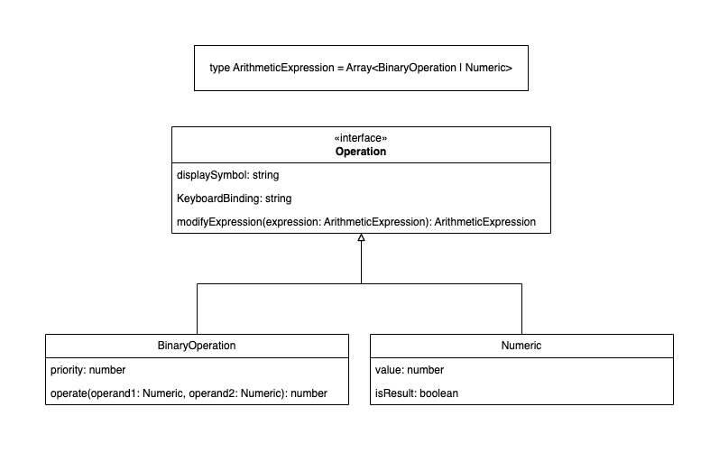

# calculator

This is an example of app build with Vite + Vuejs + Pinia + tailwindcss

## Run Project

You need to install [node.js](https://nodejs.org/) in environment and then:

```sh
npm install
```

### Compile and Hot-Reload for Development

```sh
npm run dev
```

### Type-Check, Compile and Minify for Production

```sh
npm run build
```

### Run Unit Tests with [Vitest](https://vitest.dev/)

```sh
npm run test:unit
```

## Achitecture

The solution this project proposes is to manage the calculator state as an `ArithmeticExpression`
which at the end is an array of numbers and operators:

```
expression = [ 5, +, 4, *, 3  ]
```

Then we convert to [Reverse Polish Notation](https://en.wikipedia.org/wiki/Reverse_Polish_notation)
to solve it.

Reverse Polish Notation (or RPN) is a Postfix notation (operators after operands) while our mostly
used notation is an Infix notation (operators between a left and right operands).

To convert from Infix to Postfix notation we use the
[Shunting yard algorithm](https://en.wikipedia.org/wiki/Shunting_yard_algorithm).

[Here](https://dev.to/quantumsheep/how-calculators-read-mathematical-expression-with-operator-precedence-4n9h) you can find an article about this.

All this is done in the `CalculatorService`. To model the domain we create the following interfaces,
types and classes:



The idea is to have the `Numeric` and `BinaryOperation` to model the `ArithmeticExpression`. Only
those objects are allowed inside the expression.

But it can be other `Operation`s to modify the expression. These operations are the decimal point,
the memory operations, the equals (to solve the expression using the `CalculatorService`), etc.

All the operations are added and run using a simplified version of `Command Pattern`.

This way new operations can be added easily without affecting all the system.

The layout of the buttons in the `Calculator.vue` component are also easy to modify, including them
on array used to render de buttons.
